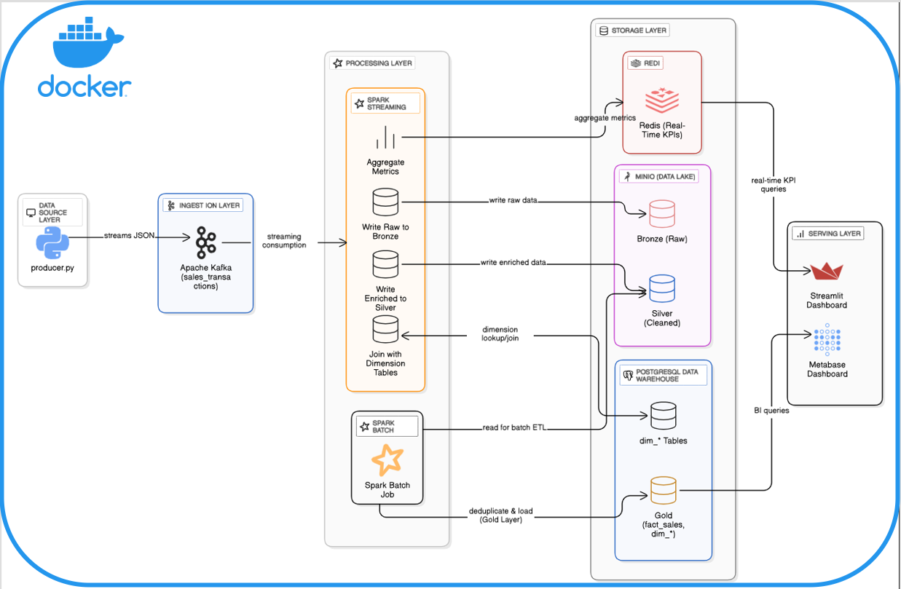
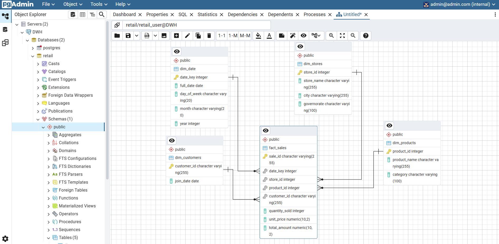
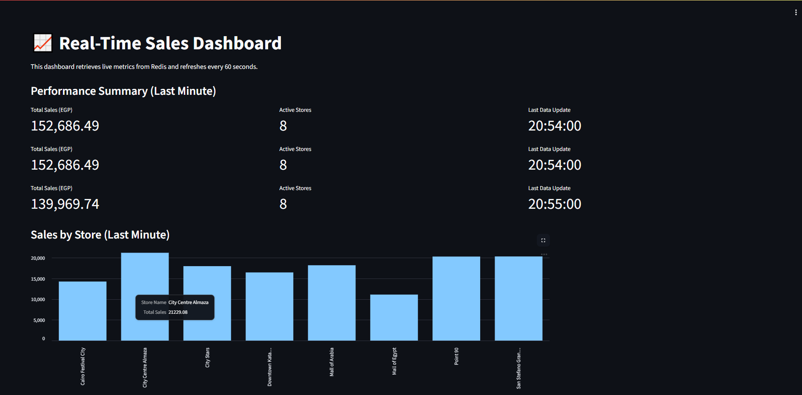
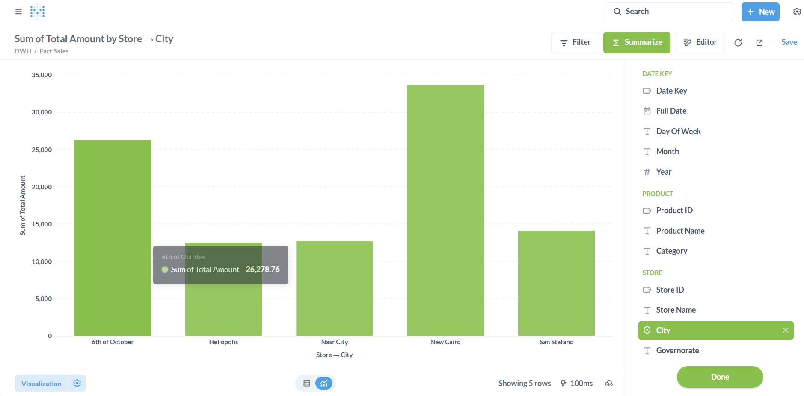

# Real-Time Retail Analytics Pipeline

This project demonstrates a complete, end-to-end data engineering pipeline designed to ingest, process, and analyze retail data in real-time. It provides immediate insights into sales, inventory, and customer behavior, enabling data-driven decisions for a fictional retail company.

The entire infrastructure is containerized using Docker and orchestrated with Docker Compose, making it portable, scalable, and easy to deploy.

## Table of Contents
- [Project Objective](#project-objective)
- [Key Features](#key-features)
- [Technical Architecture](#technical-architecture)
- [Data Flow](#data-flow)
- [Technology Stack](#technology-stack)
- [Data Models](#data-models)
- [Project Structure](#project-structure)
- [How to Run the Project](#how-to-run-the-project)
- [Dashboards & Visualizations](#dashboards--visualizations)
- [Future Improvements](#future-improvements)

## Project Objective

The goal is to build a scalable and fault-tolerant system that can:
1.  **Ingest** high-velocity data streams from multiple sources (simulated Point-of-Sale systems).
2.  **Process** and enrich this data in real-time.
3.  **Store** raw data for archival, processed data for ad-hoc analysis, and aggregated data for business intelligence.
4.  **Serve** insights through live dashboards and a robust data warehouse.

This project showcases a modern data stack and best practices in data engineering, including Kappa/Lambda architecture patterns and the Medallion data model.

## Key Features

- **Real-Time Processing:** Utilizes Spark Structured Streaming for low-latency data transformation and aggregation.
- **Scalable Ingestion:** Employs Apache Kafka as a distributed, fault-tolerant message broker to handle high-throughput data streams.
- **Medallion Architecture:** Organizes data into Bronze (raw), Silver (cleaned), and Gold (aggregated) layers within a MinIO-based data lake.
- **Hybrid Architecture:** Combines a real-time streaming path (Speed Layer) for live dashboards and a batch ETL path (Batch Layer) to build a reliable Data Warehouse.
- **Containerized Environment:** The entire stack is containerized with Docker and managed via Docker Compose for consistency and ease of setup.
- **Data Warehousing:** Populates a PostgreSQL Data Warehouse with a Star Schema, optimized for analytical queries from BI tools.
- **Live Dashboards:** Features a live dashboard built with Streamlit that visualizes key metrics from Redis, updated every few seconds.

## Technical Architecture

The architecture is composed of several decoupled layers, ensuring scalability and maintainability.



 
*A simplified diagram of the data flow and components.*

## Data Flow

1.  **Data Generation:** A Python script (`producer.py`) simulates sales transactions from multiple retail stores in Egypt. It generates realistic JSON messages and sends them to a Kafka topic.

2.  **Ingestion:** Apache Kafka receives the messages in the `sales_transactions` topic, acting as a durable buffer.

3.  **Real-Time Processing (Spark Streaming):**
    *   A Spark Structured Streaming job (`spark_processor.py`) consumes data from Kafka.
    *   **Bronze Layer:** Raw data is immediately written to the MinIO data lake at `s3a://lake/bronze/`.
    *   **Enrichment:** The job enriches the streaming data by joining it with dimension tables (stores, products) loaded from PostgreSQL.
    *   **Silver Layer:** The cleaned, structured, and enriched data is written as Parquet files to `s3a://lake/silver/`.
    *   **Live Aggregation:** The same job performs windowed aggregations (e.g., total sales per store over a 1-minute window) and writes the results to **Redis** for the live dashboard.

4.  **Batch Processing (Spark Batch ETL):**
    *   A separate, periodic Spark batch job (`batch_etl.py`) runs to build the data warehouse.
    *   It reads all cleaned data from the **Silver Layer** in MinIO.
    *   It filters out records that already exist in the warehouse to ensure idempotency.
    *   It loads the new, aggregated data into the `fact_sales` and `dim_*` tables in the **PostgreSQL Data Warehouse (Gold Layer)**.

5.  **Data Consumption:**
    *   **BI Dashboard (Metabase):** Connects to the PostgreSQL DWH for deep analytical reporting.
    *   **Live Dashboard (Streamlit):** Reads near-real-time metrics directly from Redis.

## Technology Stack

| Category              | Technology                                        | Purpose                                             |
| --------------------- | ------------------------------------------------- | --------------------------------------------------- |
| **Data Ingestion**    | `Apache Kafka`                                    | Distributed, high-throughput message queue.         |
| **Data Processing**   | `Apache Spark` (Structured Streaming & Batch)     | Core engine for data transformation and aggregation.|
| **Data Lake Storage** | `MinIO`                                           | S3-compatible object storage for Bronze/Silver data.|
| **Data Warehouse**    | `PostgreSQL`                                      | Relational database for the Gold Layer (Star Schema).|
| **In-Memory Cache**   | `Redis`                                           | Caching real-time metrics for the live dashboard.   |
| **Containerization**  | `Docker`, `Docker Compose`                        | For creating a reproducible and isolated environment. |
| **Programming**       | `Python` (PySpark), `SQL`                         | For data generation, processing, and analysis.      |
| **Visualization**     | `Streamlit`, `Metabase`                           | For building live and analytical dashboards.        |

## Data Models

#### 1. Kafka JSON Message

Each message from the producer represents a single transaction.
```json
{
  "transaction_id": "a1b2c3d4-...",
  "timestamp_utc": "2024-07-08T10:00:00Z",
  "store_id": 3,
  "customer_id": "cust_550",
  "products": [
    {"product_id": 107, "quantity": 1, "unit_price": 75.50},
    {"product_id": 102, "quantity": 2, "unit_price": 45.00}
  ],
  "total_amount": 165.50
}
```

#### 2. PostgreSQL Star Schema (Gold Layer)

The data warehouse is modeled as a star schema for efficient analytical querying.



-   **`fact_sales`**: Contains quantitative data about each sale item.
-   **`dim_stores`**, **`dim_products`**, **`dim_customers`**, **`dim_date`**: Contain descriptive attributes.

## Project Structure

```
.
├── app/                  # Spark applications
│   ├── batch_etl.py      # Batch job (Silver -> Gold)
│   └── spark_processor.py  # Streaming job (Kafka -> bronze/Silver/Redis)
│   └── Dockerfile          # Dockerfile to build a custom Spark image with Redis
├── dashboard/
│   └── live_dashboard.py   # Streamlit live dashboard code
│   └── Dockerfile          # Dockerfile to build a custom kafka image
├── data_producer/
│   └── producer.py         # Python script to generate and send data to Kafka
├── sql/
│   └── init.sql            # SQL script to initialize DWH schema and tables
└── docker-compose.yml      # Main file to orchestrate all services
```

## How to Run the Project

Follow these steps to get the entire pipeline up and running.

#### Prerequisites
- Docker and Docker Compose installed.
- Python 3.8+ (for running the producer script locally).

#### Step 1: Clone the Repository
```bash
git clone https://github.com/hossam-mansour0/Real-time-Data-Streaming-Platform-using-Kafka-and-Spark.git
cd Real-time-Data-Streaming-Platform-using-Kafka-and-Spark
```

#### Step 2: Build and Start All Services
This command will build the custom Spark image and start all containers (Kafka, Spark, MinIO, etc.) in detached mode.
```bash
docker-compose up -d --build
```
Wait for a minute for all services to initialize. You can check the status with `docker-compose ps`.

#### Step 3: Create the MinIO Bucket
This step only needs to be done once.
```bash
docker-compose exec minio mc alias set myminio http://localhost:9000 minioadmin minioadmin
docker-compose exec minio mc mb myminio/lake
```
#### Step 4: Load the DWH schema into postgres
This step only needs to be done once.
```bash
cat sql/init.sql | docker-compose exec -T postgres psql -U retail_user -d retail
```
#### Step 5: Submit the Spark Streaming Job
This job will start listening for data from Kafka.
```bash
docker-compose exec spark-master /opt/bitnami/spark/bin/spark-submit \
  --master spark://spark-master:7077 \
  --packages org.apache.spark:spark-sql-kafka-0-10_2.12:3.4.1,org.apache.hadoop:hadoop-aws:3.3.4,org.postgresql:postgresql:42.6.0 \
  /opt/bitnami/spark/app/spark_processor.py
```

#### Step 6: Start the Data Producer
In a **new terminal window**, navigate to the `data_producer` directory, install dependencies, and run the script.
```bash
cd data_producer
pip install -r requirements.txt
python producer.py
```
You should now see data being processed in the terminal running the Spark job.

#### Step 7: Run the Batch ETL Job
After a few minutes of data generation, you can run the batch job to populate the data warehouse.
```bash
docker-compose exec spark-master /opt/bitnami/spark/bin/spark-submit \
  --master spark://spark-master:7077 \
  --packages org.apache.hadoop:hadoop-aws:3.3.4,org.postgresql:postgresql:42.6.0 \
  /opt/bitnami/spark/app/batch_etl.py
```

## Dashboards & Visualizations

#### 1. Live Dashboard (Streamlit)
-   **Purpose:** Shows near-real-time sales metrics, updated every minute.
-   **How to run:**
    ```bash
    cd dashboard
    pip install -r requirements.txt
    streamlit run live_dashboard.py
    ```
-   Access it at `http://localhost:8501`.


#### 2. BI Dashboard (Metabase)
-   **Purpose:** For in-depth business analysis and reporting from the data warehouse.
-   **Setup:** A Metabase service is included in the `docker-compose.yml`.
-   Access it at `http://localhost:3000`.
-   Set it up by connecting to the `postgres` database with the credentials from the `docker-compose.yml` file. You can then build questions and dashboards on top of the `fact_sales` table.


## Future Improvements

-   **Workflow Orchestration:** Integrate an orchestrator like **Apache Airflow** to schedule the `batch_etl.py` job automatically.
-   **Data Quality Checks:** Implement data quality and validation checks using libraries like **Great Expectations** in the Silver layer.
-   **Advanced Analytics:** Use the data in the lake to train machine learning models (e.g., sales forecasting, customer segmentation).
-   **Schema Management:** Introduce a schema registry like the **Confluent Schema Registry** to manage and enforce schemas for Kafka topics.

